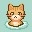
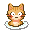
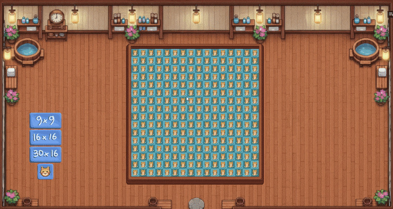
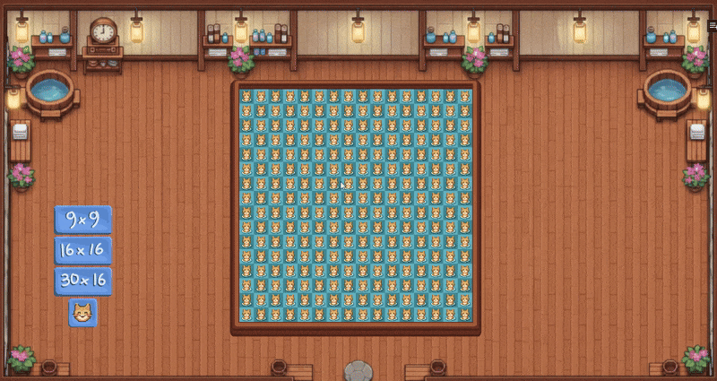

#   Catsweeper  

**Catsweeper** is a cozy, bathhouse-themed reimagining of the classic Minesweeper. 

My love of Minesweeper is only capped by the not-so-pleasant looks of the current clones out there. The ones that look alright don't feel good to play.  Made for my fellow minesweeper lovers who want something that feels good the play and also looks pretty!

[**🎮 Play the latest build on itch.io**](https://jeremellev.itch.io/catsweeper)

---

## Gallery

  
  

---

## Project Status

This project is currently in development, many updates await!

The current status of the game is available to play on itch with the link above.
